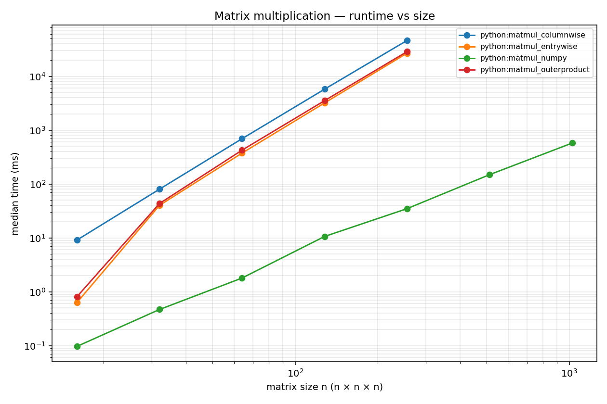

# 4 — Benchmarking Python

**Goal**: measure runtime and peak memory of your three matmul variants and produce a CSV.

This is the second piece of new pedagogy in this assignment. After this chapter you will know how to time a function, what `tracemalloc` does, why a single timed run is misleading, and how to think about the two independent dimensions of a benchmark sweep.

## What "benchmarking" actually means

A benchmark answers two questions: *how long does this code take* and *how much memory does it use*. That sounds simple — call the function, look at the clock — but a single timed call is wrong by tens of percent and the wrongness depends on what your laptop happened to be doing at that moment. Real benchmarking is mostly about *removing noise*, not about reading the clock. The recipe is always the same: run the same code many times, throw away the warm-up run, and report a robust statistic (the median, not the mean).

There are libraries that do this for you — `pytest-benchmark`, `pyperf`, `timeit`. For this assignment we wrote our own loop in [`python/bench/benchmark.py`](../python/bench/benchmark.py) because it's short, every step is visible, and seeing the loop spelled out is the point.

## How `benchmark.py` differs from the test suite

`pytest` discovers test functions automatically — you don't write a `main()`, you write a `def test_*()` and pytest finds it. `benchmark.py` is the opposite: a plain Python script with an explicit entry point at the bottom:

```python
if __name__ == "__main__":
    main()
```

That guard means `main()` runs *only* when you execute the file directly (`uv run python bench/benchmark.py`). There's no auto-discovery, no fixtures, no markers, no plugin layer — `main()` calls `benchmark_variant()` which calls `time_one_call()`, and that's the entire mechanism. Reading the file top-to-bottom takes about three minutes and is the single best way to internalise what a benchmark loop is.

## The two knobs: `SIZES` and `RUNS`

These are the two configuration values at the top of `benchmark.py`:

```python
SIZES = {
    "matmul_entrywise":   [16, 32, 64, 128, 256],
    "matmul_columnwise":  [16, 32, 64, 128, 256],
    "matmul_outerproduct":[16, 32, 64, 128, 256],
    "matmul_numpy":       [16, 32, 64, 128, 256, 512, 1024],
}

RUNS = 5
```

They look similar but answer different questions.

**`SIZES` is *what* to measure.** A per-variant list of matrix dimensions `n`. For each `n` in the list, the benchmark builds two random `n × n` matrices and multiplies them. The lists differ per variant on purpose: pure-Python matmul is O(n³) executed *in the interpreter*, so going from `n = 256` to `n = 512` is 8× more work and `n = 256` to `n = 1024` is 64× more work — the latter would take roughly an hour. NumPy at `n = 1024` finishes in tens of milliseconds, so we let it sweep further. The width of the sweep matters because the log–log plot in chapter 5 needs at least three sizes spanning a decade for the slope-3 (cubic) line to be visible; with only two points you can fit any slope.

**`RUNS` is *how reliably* to measure.** The number of timed measurements of the *same* (variant, size) cell. A single timed call jitters by tens of percent — the OS may schedule another process mid-loop, the memory allocator may map a fresh page, the CPU may throttle. We take five measurements and report the median. Median over mean because the noise is one-sided: jitter only ever *adds* time, it never subtracts. Five is a compromise: three would still leave the median noisy, ten would double the runtime for a marginal accuracy gain.

So the two knobs answer separate questions, and the total number of calls per variant is the *product*:

```text
SIZES → outer loop, varies the workload      (n = 16, 32, 64, 128, 256, ...)
RUNS  → inner loop, varies the measurement   of a fixed workload
WARM-UP → one extra untimed call before the RUNS loop, discarded
```

For `matmul_entrywise`: 5 sizes × (5 + 1) = **30 calls**. For `matmul_numpy`: 7 sizes × 6 = **42 calls**. The warm-up is there because the very first call pays for module imports, first-touch page faults, and the standard library lazily caching things — costs that don't apply to subsequent calls and would skew the first measurement upward.

## What `time_one_call` actually does

The core measurement is six lines:

```python
def time_one_call(method, A, B):
    tracemalloc.start()
    t0 = time.perf_counter()
    method(B)
    t1 = time.perf_counter()
    _, peak = tracemalloc.get_traced_memory()
    tracemalloc.stop()
    return ((t1 - t0) * 1000.0, peak)
```

Two things are being measured around the call:

- **`time.perf_counter()`** — Python's high-resolution monotonic clock. "Monotonic" means it never jumps backwards (unlike `time.time()`, which can if NTP adjusts the system clock mid-measurement). Returns seconds; we multiply by 1000 to get milliseconds.
- **`tracemalloc`** — a Python-built-in that tracks heap allocations between `start()` and `stop()`. `get_traced_memory()` returns `(current, peak)`; we keep the peak because that's what tells us "how big did this get at any point during the call". Importantly, `tracemalloc` only sees allocations made by the Python interpreter itself — not C buffers allocated by NumPy or by C extensions. The `peak_kb` column is therefore honest for the pure-Python variants and an underestimate for `matmul_numpy`.

`benchmark_variant` calls this function `RUNS + 1` times per cell, drops the first result, takes the median of the remaining five, and writes one CSV row.

[`python/bench/plot_results.py`](../python/bench/plot_results.py) is the second script — also complete. It reads any CSV in `results/` (so adding C++ later is automatic) and writes `results/comparison.png`.

## Run it

From `python/`:

```bash
uv run python bench/benchmark.py
```

This takes a couple of minutes — pure Python at `n = 256` is genuinely slow. Then:

```bash
uv run python bench/plot_results.py
```

You should now see `results/python.csv` and `results/comparison.png`.

## Reading the CSV

Look at `results/python.csv` first. You should see something like (your numbers will differ — these are from one run on a typical laptop):

```text
variant,size,time_ms,peak_kb,runs
matmul_entrywise,16,0.63,8,5
matmul_entrywise,32,40.1,38,5
matmul_entrywise,64,374,158,5
matmul_entrywise,128,3192,643,5
matmul_entrywise,256,26841,2595,5
matmul_columnwise,16,9.1,12,5
matmul_columnwise,32,80,50,5
...
matmul_numpy,16,0.10,14,5
...
matmul_numpy,1024,575,65592,5
```

Two things to notice before plotting anything:

- **The numbers span five decades.** `matmul_numpy` at `n = 16` is 0.10 ms; `matmul_entrywise` at `n = 256` is 26,841 ms (~27 seconds). That's a factor of 270,000.
- **Doubling `n` multiplies pure-Python time by ~8.** Track the entrywise column: 40 → 374 → 3192 → 26841 ms as `n` goes 32 → 64 → 128 → 256. Each step is roughly 8×. That's the cubic-complexity story (`(2n)³ = 8 · n³`) showing up in the data before any plot.

## Reading the plot

Run `uv run python bench/plot_results.py` and open `results/comparison.png`. Here's the reference plot from one run — yours should have the same *shape*, even if the absolute numbers differ:



The plot may look strange the first time you see it because **both axes are on a log scale**, not the linear scale you're used to. A linear axis goes 0, 1, 2, 3, ... with equal spacing per gridline. A log axis goes 1, 10, 100, 1000, ... — each gridline is *ten times* bigger than the previous. Two reasons we need that here:

- The runtime numbers span five decades. On a linear axis, the NumPy line at 0.1 ms would be invisibly squashed against the bottom next to a pure-Python line at 26,000 ms — you'd only see the slowest variant. Log scale puts them all on the page at once.
- A polynomial relationship like `t = c · n³` becomes a **straight line** on log–log axes, and its slope tells you the exponent. That's the headline visual we're looking for.

### Why slope = exponent

Take logs of both sides of `t = c · n³`:

```text
log(t) = 3 · log(n) + log(c)
```

That's the equation of a straight line `y = m · x + b`, with slope `m = 3`. So:

- A straight line with slope 1 means `t ~ n` (doubling `n` doubles the time).
- A straight line with slope 2 means `t ~ n²` (doubling `n` quadruples the time).
- A straight line with slope 3 means `t ~ n³` — doubling `n` multiplies time by 8.

### The doubling test (no slope-measuring required)

You don't actually need to read the slope visually. Pick any two points where `n` doubles, divide the times, and compare to 8:

| variant   |   n |   time (ms) | ratio to previous | what n³ predicts |
| --------- | --: | ----------: | ----------------: | ---------------: |
| entrywise |  32 |          40 |                 — |                — |
| entrywise |  64 |         374 |              9.4× |               8× |
| entrywise | 128 |       3,192 |              8.5× |               8× |
| entrywise | 256 |      26,841 |              8.4× |               8× |

All three pure-Python variants (`entrywise`, `columnwise`, `outerproduct`) pass this test from `n = 64` onwards — that's why their lines are visibly straight on the plot in that region. Below `n = 64` the lines bend upward because the numbers are dominated by per-call overhead (Python interpreter startup, cache warming, measurement noise at sub-millisecond times) rather than by the cubic inner work.

### What about NumPy?

NumPy's line is also straight, but its slope is shallower than 3. Run the doubling test on it:

| variant |    n | time (ms) | ratio to previous |
| ------- | ---: | --------: | ----------------: |
| numpy   |   64 |       1.8 |                 — |
| numpy   |  128 |      10.6 |              5.9× |
| numpy   |  256 |      34.9 |              3.3× |
| numpy   |  512 |       149 |              4.3× |
| numpy   | 1024 |       575 |              3.9× |

Doubling ratios sit between 3.3 and 5.9 — between `n²` (4×) and `n³` (8×). The big-O is still cubic for any matmul algorithm at these sizes, but the *constants* shrink as `n` grows because BLAS does more work per cache line, more SIMD lanes per cycle, and more loop iterations per dispatch overhead. Chapter 5 explains why that gap exists.

## Things to notice (worth writing down as you go)

1. **Absolute order at `n = 256`**: Which variant is fastest? Which is slowest? The gap is usually within a factor of 2 — *all three are doing the same work*.

2. **`outerproduct` peak memory**: Did your implementation accumulate in place, or did it build a list of intermediate matrices? If you wrote it the wrong way, peak memory blows up by a factor of `k` and you'll see it here.

3. **`numpy` runtime at `n = 256`**: Compare to your fastest pure-Python variant at the same size. Note the ratio. You will explain it in chapter 5.

## Hints

<details markdown="1">
<summary>The tracemalloc asymmetry: where does it leave NumPy?</summary>

The body already noted that `tracemalloc` doesn't see NumPy's C buffers, so `peak_kb` for `matmul_numpy` is an underestimate. The interesting framing is that NumPy is *invisible* to Python's memory tracker because it lives below the Python heap — and C++ code in part B will be even more invisible. For a fair memory comparison, look at the C++ numbers in chapter 8 — they're measured by the OS (`/usr/bin/time -v` on Linux/macOS, `PeakWorkingSet64` on Windows).

</details>

<details markdown="1">
<summary>Can I make the benchmark go faster?</summary>

Two knobs: `RUNS = 5` at the top of `benchmark.py` (drop to 3 if you're impatient), or remove `n = 256` from the `SIZES` list for the slowest variant. Don't shrink the largest size below 128 — the cubic story isn't visible at small `n`.

</details>

→ Continue with [05 — Python vs NumPy](05-python-vs-numpy.md)
